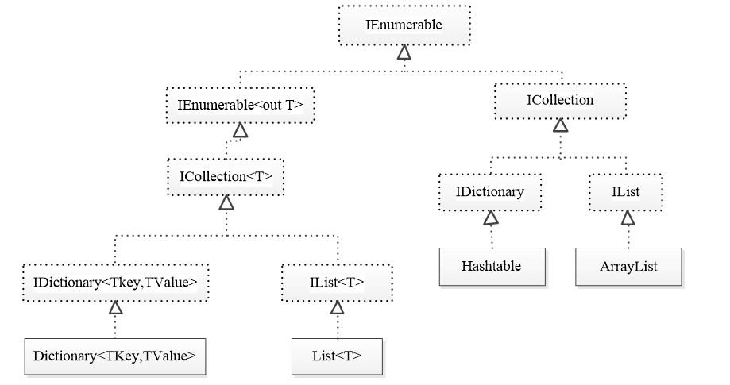

# C#语言基础学习指南

[[toc]]

# 常用类法
- string类
- DateTime类
- Random类
- 高效的StringBuilder类

## string类
- 字符串就是指一连串的字符，表示字符串的类为string。
- string字符串中可以包含任意字符，这些字符必须包含在一对英文双引号""之内，例如"Hello World"。
- 在使用string字符串之前首先需要对string类进行初始化。
```c#
string message = "Hello, world!";
String message = new String("Hello, world!");//使用new关键字初始化string字符串，本质上是创建了一个String对象，并把字符串"Hello, world!"赋给这个对象。
```
### string的初始化
- string 和String类都可以创建字符串对象；不同的是，string是C#语言中用来表示字符串的类型，而String类型是.NET Framework 通用类型系统中用来表示字符串的类型。
- 在程序开发过程中，这两种类型之所以都能表示字符串，是因为程序编译时，C#语言中的string类型会被编译成.NET Framework通用类型系统的String类型。
- 使用string类的构造方法初始化字符串对象，常用的两个构造方法如下：
```c#
string(Char[] charArray)//将string类的新实例初始化为由Unicode字符数组指示的值。
Chart[] chars = {'1','2','3'}
string str = new string(chars)//创建一个字符串对象，并把chars数组中的元素赋给这个对象
Console.WriteLine("str1 ="+str);//输出123

string(CHar ch,int num)//将string类的新实例初始化为由重复指定次数的指定Unicode 字符指示的值。
string str2 = new string('a',6)//创建一个字符串对象，并把a重复6次赋给这个对象
Console.WriteLine("str2 ="+str2);//输出aaaaaa
```

- 在编码过程中，定义string类型的变量后如果不需要立即对其进行初始化，一般会将其初始化为一个空字符串。
```c#
string str1 = "";
string str2 = "";
```
- .NET平台中提供了一个空字符串常量**String.Empty**，该常量可以代替上述空字符串。
- 由于字符串拘留池机制，使用空字符串（“”）和使用String.Empty是同一个对象，因此，这两种空字符串的定义是一样的
```c#
string str1 = String.Empty;
string str2 = String.Empty;
```

### 字符串的不可变性
- 在C#中，字符串的不可变性指的是字符串对象一旦创建，就无法被修改。
- 在代码编写过程中，有时需要创建多个字符串对象，由于字符串具有不可变性，因此这些字符串对象对应的值都会占用内存空间。
- 为此，.NET框架的底层提供了一种机制，当一个字符串已经被创建，那么以后每次创建相同值的字符串时会直接引用他的地址值，而无需为自己的值开辟新的内存空间。这种机制称为字符串**拘留池机制**。
- 字符串拘留池机制是由.NET框架来完成的，不用人为的管理，这样可以提高字符串使用的效率。

### 字符串与字符数组
- 在程序开发中，为了方便访问字符串中的某个字符，可以将字符串看作一个char类型的数组，即字符数组。
- 需要注意的是，由于字符串是不可变的，str字符串只能看作是只读的字符数组。
- 同字符数组类似，字符串可以通过Length属性来获取长度。
```c#
string str = "Hello, world!";
Console.WriteLine(str[0]);//输出H
Console.WriteLine(str[1]);//输出e
Console.WriteLine(str[2]);//输出l
```

### string类的静态方法
- 在程序开发中，经常需要在不实例化字符串的情况下实现某些功能，比如判断字符串是否为空、格式化字符串。
- string类提供了一些静态方法，用于实现上述功能:Compare()、Format()、IsNullOrEmpty()、Join()。
- **int Compare(string str1,string str2)**，比较两个字符串是否相等。如果两个字符串相等，则返回0，否则返回一个非零值。
  - 该方法有两个string类型参数，用于接收进行对比的字符串。如果第一个字符串大于第二个字符串，则返回一个大于0的int整数；如果两个字符串相同，则返回0；若第一个字符串小于第二个字符串，则返回一个小于0的int整数。
  - 字符串比较时，采用了字典排序法，从第一个字符开始比较，如果第一个字符相同，则比较第二个字符，以此类推，直到比较完所有的字符。
```c#
  string str1 = "Hello, world!";
  string str2 = "Hello, world!";
  Console.WriteLine(string.Compare(str1,str2));//输出0
```

- **string Format(string str1,Object obj)**，格式化字符串，将obj对象格式化成字符串，并返回格式化后的字符串。
  - 格式化字符串。该方法是通过占位符“{0}、{1}”的形式返回一个拼接的字符串。
```c#
string str1 = "abc"
///第一个占位符{0}是第二个参数str的值，第二个占位符{1}是第三个参数str.Length的值
Console.WriteLine(string.Format("字符串{0}包含了{1}个字符",str,str.Length));//输出abcdef
```

- **bool IsNUllOrEmpty(string str)**，判断一个字符串是否为空或者长度为0。如果字符串为空或者长度为0，则返回true，否则返回false。
```c#
static void Main(string[] args){
  string str1 = "";
  string str2 = null;
  string str3 = "abc";
  Check(str1,"str1")
  Check(str2,"str2")
  Check(str3,"str3")
}
public void Check(string str,string name){
  if(string.IsNullOrEmpty(str)){
    string res = string.Format("{1}{0}为空或者长度为0",str,name)
    Console.WriteLine(res);
    //str1str1为空或者长度为0
    //str2str2为空或者长度为0
  }
}
```

- **string Join(string str,string[] strArray)**，使用指定字符连接字符串数组。
```c#
string[] strArray = {"1","2","3","4"};
string str1 = string.Join(',',strArray);
string str2 = string.Join('-',strArray);
Console.WriteLine(str1);//输出1,2,3,4
Console.WriteLine(str2);//输出1-2-3-4
```

### string类的实例方法
- 除静态方法外，string类中还提供了一些方法，这些方法需要先创建实例对象才能被调用，即string类的实例方法。
  - **Contains(string str)**，判断字符串中是否包含指定的字符串。如果包含指定的字符串，则返回true，否则返回false。
  - **EndsWith(string str)**，判断当前字符串是否使用指定字符串结尾，如果是，则返回true，否则返回false。
  - **StartsWith(string str)**，判断当前字符串是否使用指定字符串开头，如果是，则返回true，否则返回false。
  - **IndexOf(string str)**，获得指定字符或字符串在当前字符串中的位置，找到的第一个字符或字符串的索引位置，返回位置的索引，如果没有找到，则返回-1。
  - **Split(char[] charArray)**，将字符串以某种字符分隔。
  - **Substring(int startIndex,int length)**，从index索引处截取当前字符串。
  - **ToCharArray()**，将字符串转换为字符数组。
  - **ToLower()**，将字符串转换为小写。
  - **ToUpper()**，将字符串转换为大写。
  - **Trim()**，去除字符串两端的空格。
```c#
static void Main(string[] args){
  string str4 = "这,是一个,测试-字-符-串";
  Check(str4,"str4")
}
public void Check(string str,string name){
  if (str.Contains("测试"))
  {
      string res = string.Format("{1}包含了", str, name);
      Console.WriteLine(res + "测试");
  }
  if (str.EndsWith("串"))
  {
      string res = string.Format("{1}以串字结尾", str, name);
      Console.WriteLine(res);
  }
  if (str.StartsWith("这"))
  {
      string res = string.Format("{1}以这字开始", str, name);
      Console.WriteLine(res);
  }
  int index = str.IndexOf("一");
  int index2 = str.IndexOf("二");
  if (index >= 0)
  {
      string res = string.Format("{1}包含了", str, name);
      Console.WriteLine(res + "字符一，在" + index + "位置");
  }
  else
  {
      string res = string.Format("{1}不包含", str, name);
      Console.WriteLine(res + "字符一");
  }
  if (index2 >= 0)
  {
      string res = string.Format("{1}包含了", str, name);
      Console.WriteLine(res + "字符二，在" + index2 + "位置");
  }
  else
  {
      string res = string.Format("{1}不包含", str, name);
      Console.WriteLine(res + "字符二");
  }
}
```
- 在 C# 中，数组是引用类型，直接打印数组变量时，默认调用的是ToString()方法，而数组的**ToString()**方法返回的是类型信息，而不是数组内容。
```c#
static void Main(string[] args){
  string str4 = "这,是一个,测试-字-符-串";
  Check(str4,"str4")
}
public void Check(string str,string name){
  char[] arr = {'-'};
  string[] res2 = str.Split( new char[] {','});
  string[] res3 = str.Split(arr);
  //这里不能直接打印res2和res3，因为它们是数组类型，需要遍历数组才能打印出每个元素的值
  for (int i = 0; i < res2.Length; i++) { 
      Console.WriteLine("以,分割的结果为：" + res2[i]);
  }
  for (int i = 0; i < res3.Length; i++)
  {
      Console.WriteLine("以-分割的结果为：" + res3[i]);
  }
  //ToCharArray方法返回的是字符数组
  char[] arr2 = str.ToCharArray();
  for (int i = 0; i < arr2.Length; i++)
  {
    Console.WriteLine("第" + (i + 1) + "个字符是：" + res[i]);
  }
}
```
- trim()方法去除字符串两端的空格,或者去除指定的字符。
```c#
string str = "  Hello World  ";

string result = str.Trim();//去除两端空格

Console.WriteLine("原字符串: '" + str + "'");        // '  Hello World  '
Console.WriteLine("去除后: '" + result + "'");       // 'Hello World'
Console.WriteLine("原字符串长度: " + str.Length);    // 15
Console.WriteLine("去除后长度: " + result.Length);   // 11


string result = str.TrimStart();//去除开头空格

Console.WriteLine("原字符串: '" + str + "'");        // '  Hello World  '
Console.WriteLine("去除开头: '" + result + "'");     // 'Hello World  

string result = str.TrimEnd();////去除结尾空格

Console.WriteLine("原字符串: '" + str + "'");        // '  Hello World  '
Console.WriteLine("去除结尾: '" + result + "'");     // '  Hello World'

string str1 = "***Hello World!***";
char[] trimChars = { '*', '!' };//去除指定的字符*和!
string result1 = str1.Trim(trimChars);

Console.WriteLine("原字符串: '" + str1 + "'");    // '***Hello World!***'
Console.WriteLine("去除后: '" + result1 + "'");   // 'Hello World'
```
- 空白字符包括：**空格**" "；**制表符**"\t"；**换行符**"\n"；**回车符**"\r"；其他 Unicode 空白字符。

### StringBuilder类
- stringBuilder类是一个可变字符串类，它允许在字符串的末尾添加字符，而不需要创建新的字符串对象。
- StringBuilder类创建的字符串的长度是可以改变的，他类似一个字符容器，当在其中添加或删除字符时，并不会产生新的StringBuilder对象，因此可以让字符串的拼接操作变的更加高效。
  - **Append()**方法，将指定的字符串添加到当前实例的末尾。
  - **Insert()**方法，将指定的字符串插入到当前实例的指定索引处。
  - **Replace()**方法，使用字符串str2替换StringBuilder对象中的字符串str1
  - **Rremove()**方法，将字符串从指定索引位置index开始，移除 length长度字符串。
  - **ToString()**方法，将StringBuilder对象转换为字符串。
  ```c#
  class Program{
    static void Main(string[] args) {
      StringBuilder sb = new StringBuilder();//创建一个StringBuilder对象
      sb.Append("abcd");
      Console.WriteLine("追加字符串:" + sb.ToString());//输出：abcd
      sb.Insert(3, "aaa");
      Console.WriteLine("插入字符串:" + sb.ToString());//输出：abcdaaa
      sb.Replace("a", "b");
      Console.WriteLine("替换字符串:" + sb.ToString());//输出：bbcdaaa
      Console.WriteLine("sb的长度是:" + sb.Length);//输出：7
      sb.Remove(3, 3);
      Console.WriteLine("移除字符串:" + sb.ToString());//输出：bbcd
      Console.WriteLine("sb的长度是:" + sb.Length);//输出：4
      Console.ReadKey();
    }
  }
  ```

### StringBulider性能分析
- Stopwatch类的命名空间为System.Diagnostics。
- Stopwatch类提供了两个方法：Start()和Stop()，分别用于开始和结束计时，该类还有一个属性Elapsed用于获取代码执行的总运行时间。
```c#
class Program{
  // String类性能
  static void Main(string[] args){
    string str = "";
    Stopwatch sp = new Stopwatch();
    sp.Start(); 
    for (int i = 0; i < 10000; i++){
      str += i.ToString();
    }
    sp.Stop(); // 停止计时
    Console.WriteLine(sp.Elapsed);// 输出运行时间
    Console.ReadKey();
  }
}
```
  - 对比
```c#
// StringBuilder类性能比String类性能高
static void Main(string[] args){
  StringBuilder builder = new StringBuilder();
  Stopwatch sp = new Stopwatch();
  sp.Start(); // 开始计时
  for (int i = 0; i < 10000; i++){
      builder.Append(i.ToString());
  }
  sp.Stop(); // 停止计时
  Console.WriteLine(sp.Elapsed);// 输出运行时间
  Console.ReadKey();
}
```

## DateTime类
- DateTime 表示时间。
- 构造方法：
  - DateTime(int year, int month, int day), 创建指定年月日的时间。
  - DateTime(int year, int month, int day, int hour, int minute, int second), 创建指定年月日时分秒的时间。
```c#
namespace Program19{
  class Program{
    static void Main(string[] args){
      DateTime dt1 = new DateTime(2022, 5, 24);
      DateTime dt2 = new DateTime(2022, 5, 24, 15, 5, 5);
      Console.WriteLine("dt1:" + dt1);//输出：2022-05-24 00:00:00
      Console.WriteLine("dt2:" + dt2);//输出：2022-05-24 15:05:05
      Console.ReadKey();
    }
  }
}
```
- TimeSpan 对象用于表示时间间隔，在使用Data类时经常需要通过该对象增加时间间隔。
  - TimeSpan类提供了以下构造方法：
  - TimeSpan(int hours, int minutes, int seconds),将新的 TimeSpan 初始化为指定的小时数、分钟数和秒数。
  - TimeSpan(int days, int hours, int minutes, int seconds),将 DateTime 结构的新实例初始化为指定的天、小时、分钟、秒和毫秒。
```c#
namespace Program20{
  class Program{
    static void Main(string[] args){
      TimeSpan ts1 = new TimeSpan(1, 2, 3);
      Console.WriteLine("ts1的时间间隔为：" + ts1);//输出：1.02:03:00
      TimeSpan ts2 = new TimeSpan(1, 2, 3, 4, 5);
      Console.WriteLine("ts2的时间间隔为：" + ts2);//输出：1.02:03:04.005
      Console.ReadKey();
    }
  }
}
```

### DateTime属性
- 在日期数据处理的过程中，经常需要通过DateTime对象的属性来获取日期中的某一部分的信息。
- DateTime类提供了以下属性：
  - **Year**：获取或设置DateTime实例的年份。
  - **Month**：获取或设置DateTime实例的月份。
  - **Day**：获取或设置DateTime实例的日期。
  - **Hour**：获取或设置DateTime实例的小时。
  - **Minute**：获取或设置DateTime实例的分钟。
  - **Second**：获取或设置DateTime实例的秒数。
  - **Millisecond**：获取或设置DateTime实例的毫秒数。
  - **DayOfWeek**：获取DateTime实例的星期几。
  - **DayOfYear**：获取DateTime实例的日期是该年的第几天。
  - **Ticks**：获取DateTime实例的Ticks数。
  - **Date**：获取DateTime实例的日期部分。
  - **Now**：获取当前日期和时间。
  - **Today**：获取当前日期。
```c#
static void Main(string[] args){
    DateTime dt = DateTime.Now;
    Console.WriteLine("当前时间是：" + dt);
    Console.WriteLine("年：" + dt.Year);
    Console.WriteLine("月：" + dt.Month);
    Console.WriteLine("日：" + dt.Day);
    Console.WriteLine("时：" + dt.Hour);
    Console.WriteLine("分：" + dt.Minute);
    Console.WriteLine("秒：" + dt.Second);
    Console.ReadKey();
}
```

### DateTime方法
- **DateTime Add(TimeSpan ts)**：返回一个 DateTime对象，他将指定时间间隔添加到此实例的值上。
- **bool Equals(DateTime dt)**：返回一个bool值，指示此实例是否与指定的 DateTime 实例相等。
- **string ToShortTimeString()**：将当前 DateTime 对象的值转换为其等效的短时间字符串表示。
- **string Compare (DateTime dt1, DateTime dt2)**：对两个 DateTime 的实例进行比较，并返回一个指示第一个实例是早于、等于还是晚于第二个实例的整数
```c#
static void Main(string[] args){
  DateTime dt = DateTime.Now;//获取当前时间
  Console.WriteLine("dt:" + dt);//输出：dt:2026-08-24
  TimeSpan ts = new TimeSpan(1, 0, 0);//创建一个TimeSpan对象:1小时,0分钟,0秒
  dt = dt.Add(ts);//将时间间隔添加到dt
  Console.WriteLine("dt:" + dt);//输出：dt:2026-08-24 15:05:05
  bool b = dt.Equals(DateTime.Now);//判断dt是否与当前时间相等
  Console.WriteLine("判断ts是否与系统时间相等:" + b);//输出：判断ts是否与系统时间相等:False
  string s = dt.ToShortTimeString();//将当前时间转换成短时间字符串
  Console.WriteLine("dt的时   间部分为：" + s);//输出：dt的时   间部分为：15:05:05
  int result = DateTime.Compare(dt, DateTime.Now);//对两个 DateTime 的实例进行比较
}
```

## Random类
- 在C#语言中提供了一个Random类，该类是一个伪随机数生成器，它可以随机产生数字。
  - **Random()**：使用与时间相关的默认种子值，初始化 Random 类的新实例。
  - **Random(int seed)**：使用指定的种子值初始化 Random 类的新实例。
```c#
namespace Program23{
  class Program {
    static void Main(string[] args){
      //Random无参的构造函数
      Random rd = new Random();//创建一个随机数生成器,没有知道种子，系统会根据当前时间生成一个种子，产生随机数
      for (int i = 0; i < 10; i++){
        int temp = rd.Next(); //生成一个非负的随机数
        Console.WriteLine(temp);
      }
      Console.ReadKey();
    }
  }
}
```
```c#
namespace Program24{
  class Program{
    static void Main(string[] args){
      //Random有参的构造函数
      Random rd = new Random(10);//如果指定了相同的种子，则每个实例对象产生的随机数具有相同的序列
      for (int i = 0; i < 10; i++){
        int temp = rd.Next();
        Console.WriteLine(temp);
      }
      Console.ReadKey();
    }
  }
}
```

- Random类提供了方法来生成各种伪随机数。
  - **int Next()**：返回一个非负随机整数。
  - **int Next(int maxValue)**：返返回一个小于所指定最大值的非负随机整数。
  - **int Next(int minValue, int maxValue)**：返回一个在指定范围之间的随机整数。
  - **double NextDouble()**：返回一个0.0到1.0之间的随机双精度随机浮点数。
```c#
static void Main(string[] args){
  Random rd = new Random();
  int temp;
  Console.Write("生成一个随机数字:");
  temp = rd.Next();
  Console.WriteLine(temp);
  Console.Write("生成一个小于10随机数字:");
  temp = rd.Next(10);
  Console.WriteLine(temp);
  Console.Write("生成一个大于10小于20随机数字:");
  temp = rd.Next(10, 20);
  Console.WriteLine(temp);
  Console.Write("生成一个浮点随机数字:");
  double temp1 = rd.NextDouble();
  Console.WriteLine(temp1);
  Console.ReadKey();
}
```

# 集合概述
- 为了保存这些数目不确定的对象，C#中提供了一系列特殊的类，这些类可以存储任意类型的对象，并且长度可变，统称为集合。
- C#中集合可分为泛型集合和非泛型集合，二者均间接实现了IEnumerable接口。泛型集合位于System.Collections.Generic命名空间，它只能存储同一种类型的对象，其中最常用的是**List<T>**泛型集合和**Dictionary<TKey,TValue>**泛型集合。非泛型集合位于System.Collections命名空间，它可以存储多种类型的对象，其中最常用的是ArrayList集合和Hashtable集合。
- C#中提供了丰富的集合类。为了便于初学者对集合进行系统地学习，接下来通过一个图例来描述整个集合类的继承体系，如下图所示。

- 上图中列出了程序中常用的一些集合类。其中，虚线框里填写的都是接口类型，而实线框里填写的都是具体的实现类。

## 非泛型集合

###   
- ArrayList集合就像是一个收纳盒，它可以容纳不同类型的对象。例如，可以将int、string、object等类型的对象同时加入到ArrayList集合中。ArrayList集合提供了一系列方法：
  - **Add(object value)**：将指定的对象添加到ArrayList集合中。
  - **AddRange()**:将集合或者数组添加到ArrayList集合中。
  - **Clear()**：清空ArrayList集合中的所有元素。返回一个空集合。
  - **Contains(object item)**：判断ArrayList集合中是否包含指定的对象。
  - **IndexOf(object item)**：查找指定元素，并返回该元素在ArrayList中第一个匹配项的索引，如果找不到该元素，则返回-1。
  - **LastIndexOf(object value)**：查找指定元素，并返回该元素在ArrayList中最后一个匹配项的索引，如果找不到该元素，则返回-1。
  - **Insert(int index,object item)**：将指定的对象插入到ArrayList集合的指定索引位置。使用Insert()方法向集合中添加元素时，允许插入元素的索引值比集合的最大索引值大1，如果元素的索引值超过集合的最大索引值且范围在1以上，编译时就会报异常。
  - **Remove(object item)**：从ArrayList中移除指定元素的第一个匹配项。
  - **RemoveAt(int index)**：从ArrayList集合中移除指定索引位置的元素。
  - **Reverse()**：将ArrayList集合中的元素倒序。
  - **Sort()**：将ArrayList集合中的元素排序。
- ArrayList集合的常用方法可以对集合中的元素进行添加、删除、修改和查询等操作。

### 添加元素
- 调用ArrayList对象的Add()方法、AddRange()方法、Insert()方法来添加元素。
```c#
ArrayList arr1 = new ArrayList();//创建ArrayList集合对象arr1
//使用不同方法向集合添加多个元素
arr1.Add(134);
arr1.AddRange(new ArrayList() { "张三", "李四" });
arr1.Insert(2, 'a');
//输出集合中的元素[134,张三,a,李四]
```

### 删除元素
- 调用ArrayList对象的Remove()方法、RemoveAt()方法、Clear()方法来删除元素。
```c#
ArrayList arr1 = new ArrayList();
//将新建的集合对象添加到arr1集合的末尾
arr1.AddRange(new ArrayList() { "张三", "李四", "王五" });
arr1.Remove("张三"); //从集合中移除指定元素的第一个匹配项
arr1.RemoveAt(0); //从集合中移除指定索引位置的元素
arr1.Clear();//删除集合中所有的元素
//输出集合中的元素[]
```

### 修改元素
- 修改集合中的元素
```c#
static void Main(string[] args){
  ArrayList arr1 = new ArrayList(new ArrayList() { "张三", "李四", "王五" }); 
  Console.WriteLine("修改前集合中的元素:");
  ErgoArr(arr1);//输出集合中的元素[张三,李四,王五]
  arr1[0] = 1;//修改集合中索引为0的元素为1
  arr1[1] = 2;//修改集合中索引为1的元素为2
  arr1[2] = 3;//修改集合中索引为2的元素为3
  Console.WriteLine();//输出换行
  Console.WriteLine("修改后集合中的元素:");
  ErgoArr(arr1);//输出集合中的元素[1,2,3]
  Console.ReadKey();
}
public static void ErgoArr(ArrayList arr)
{
  for (int index = 0; index < arr.Count; index++)
  {
    Console.Write("这是第" + index + "元素" + arr[index]);
  }
}
```

### 查询元素
- 调用**IndexOf()**方法或**LastIndexOf()**方法查询指定元素的索引，调用**Contains()**方法判断集合中是否存在某个元素。
- 使用**Sort()**方法排序集合。
```c#
static void Main(string[] args){
  ArrayList arr1 = new ArrayList(new ArrayList() { 1, 2, 3, 1 });
  ErgoArr(arr1);
  //查找指定元素，并返回该元素在集合中第一个匹配项的索引
  int index = arr1.IndexOf(1);
  Console.WriteLine("集合中第一个1的索引值为：" + index);//输出0
  //查找指定元素，并返回该元素在集合最后一个匹配项的索引
  int lastIndex = arr1.LastIndexOf(1);
  Console.WriteLine("集合中最后一个1的索引值为：" + lastIndex);//输出3
  bool result = arr1.Contains(2); //判断某元素是否在集合中
  Console.WriteLine("集合中是否包含元素2：" + result);//输出True
  arr1.Sort(); //对集合中的元素按照默认的顺序进行排序,变成了{1,1,2,3}
  ErgoArr(arr1);
}
public static void ErgoArr(ArrayList arr)
{
  for (int index = 0; index < arr.Count; index++)
  {
    Console.Write("这是第" + index + "元素" + arr[index]);
  }
}
```

### 遍历集合的方法
- for循环
- foreach循环
- Linq + Select
```c#
public static void Main(string[] args)
{ 
  ArrayList arr1 = new ArrayList(new ArrayList() { 0,1, 2, 3, 4,5,6,7,8,9});
  //for循环
  for(int index = 0; index < arr1.Length; index++){
    //...
  }
  //foreach循环
  int index = 0;
  foreach(var item in arr1){
    //...
    Console.WriteLine("索引: " + index + ", 值: " + item);
    index++;
  }
  //Linq + Select()
  var result = arr1.Select((item,index) => new { Item = item, Index = index });
  foreach(var element in result){
    //...
    Console.WriteLine("索引: " + element.Index + ", 值: " + element.Item);
  }
}
```

### Hashtable集合
- C#中提供了一个Hashtable集合，该集合又被称为**键值对集合**，所谓键就类似于字典中的目录，值就类似于字典中的具体汉字信息，键与值是一一对应的关系，通过唯一的键能找到对应的值，因此Hashtable集合的这种特性大大提高了查询元素的效率。
- Hashtable集合中的常用方法:
  - **Add(object key,object value)**，将带有指定键和值的元素添加到Hashtable集合中。
  - **Clear()**，从Hashtable集合中移除所有元素。
  - **Contains(object key)**，判断Hashtable集合中是否包含指定的键，如果有返回true，否则返回false。
  - **ContainsValue(object value)**，判断Hashtable集合是否包含指定的值，如果有返回true，否则返回false。
  - **Remove(object key)**，从Hashtable集合中移除带有指定键的元素。
```c#
public static void Main(string[] args)
{ 
  Hashtable ht = new Hashtable();//创建Hashtable集合对象ht
    //调用Hashtable集合的Add()方法添加元素
    ht.Add(1, "张三");
    ht.Add('A', "李四");
    ht.Add("BB", "王五");
    ErgoHash(ht);
    ht.Remove("BB"); //移除键为"BB"的元素
    ErgoHash(ht);
    ht.Clear(); //移除Hashtable集合中所有元素
    Console.WriteLine("集合ht中的元素个数:" + ht.Count);
    Console.ReadKey();
}
public static void ErgoHash(Hashtable ht){
  //遍历Hashtable集合
  foreach(Dictionary dicEn in ht){
    Console.WriteLine("键为:" + dicEn.Key + "值为:" + dicEn.Value);
  }
//在遍历Hashtable集合时，除了可以通过键来获取对应的值以外，还可以直接遍历集合中的值或集合中的对象。
  foreach(object  value in ht.values){
    Console.WriteLine("当前遍历到的值为:" + value);
  }
}
```

## 泛型集合
### List<T>泛型集合
- C#提供了一个List<T>泛型集合，该集合不仅具备ArrayList集合的功能，而且还可以保证List<T>集合只能添加同类型元素，不会出现类型转换的问题。
```c#
namespace Program08{
  class Program{
    static void Main(string[] args){
      List<string> list = new List<string>(); //创建一个List<string>泛型集合
      //向List<string>集合中添加三个string类型元素
      list.Add("Apple");
      list.Add("Banana");
      list.Add("Orange");
      //使用foreach循环遍历List<string>集合中的元素
      foreach (string item in list){
          Console.WriteLine(item + " ");//输出集合中的元素Apple、Banana、Orange
      }
      Console.ReadKey();
    }

  } 
}
```

### Dictionary<TKey, TValue>泛型集合
- Hashtable集合中的键与值在默认情况下都是object类型，这使得用户在取值时不可避免的遇到类型转换的问题。为了解决这个问题，C#中提供了泛型集合Dictionary<Tkey,TValue>，该集合中的键与值都只能是一种类型。
- 需要注意的是，集合Dictionary<TKey,TValue>中的键值对类型为**KeyValuePair< int,string>**，通过该类型的对象就可以获取集合中的键和值。
```c#
namespace Program09{
  class Program{
    static void Main(string[] args){
      Dictionary<int, string> dic = new Dictionary<int, string>();
      dic.Add(1, "张三");
      dic.Add(2, "李四");
      dic.Add(3, "王五");
      //通过遍历集合中的键获取对应的值
      foreach (int key in dic.Keys){
        Console.WriteLine(key + ":" + dic[key]);
      }
      Console.WriteLine();//空行
      dic.Remove(2); //从集合中移除指定的键与值
      //通过遍历键值对的方式来获取键与值
      foreach (KeyValuePair<int, string> kv in dic){//KeyValuePair<TKey,TValue>是一个Dictionary类的泛型结构
        Console.WriteLine(kv.Key + ":" + kv.Value);
      }
      Console.WriteLine();//换行
      Console.ReadKey();
    }
  }
}
```

### 自定义泛型
- 如果泛型集合List<T>与Dictionary<TKey,TValue>都不能满足实际需求，此时还可以自定义泛型。自定义泛型可以根据用户的不同需求，灵活的设计集合中的属性和方法。自定义泛型的语法格式如下：
```c#
[修饰符] class类名<类型占位符>{
  程序代码
}
```
- 通过自定义泛型格式可以看出，自定义泛型与普通类的语法格式相似，唯一的区别是多了一个**类型占位符**。类型占位符通常用T来表示，初学者可以自行修改，但要遵循变量的命名规范。
```c#
namespace Program10{
  class Program{
    static void Main(string[] args){
      //创建自定义泛型对象myClass
      MyClass<string> myClass = new MyClass<string>();//创建自定义的泛型对象myClass
      myClass.Add("张三"); //调用Add()方法添加一个元素
      Console.WriteLine("自定义泛型中的元素:" + myClass.Get());
      Console.ReadKey();
      //自定义泛型MyClass<T>
      class MyClass<T>{//定义一个泛型类MyClass<T>
        T myElement;  //定义一个T类型字段
        public void Add(T elem){//创建Add()方法,指定参数类型为T
          this.myElement = elem;//将参数elem的值赋给myElement字段
        }
        public T Get(){//创建Get()方法，指定返回类型为T
          return this.myElement;
        }
      }
    }
  }
}
```

## C#的lambda表达式与Linq
- **Lambda**:简单来说就是匿名方法，指数写方法体，不书写方法明称。()=>{},类似JS的箭头函数。
- **Lambda表达式**:C#中的Lambda表达式，存在两种形式：Func<TResult>和Action<T>,Func<TResult>表示有返回值，Action<T>表示没有返回值。
```c#
public delegate TResult Func<out TResult>();//注意这里的out 表示这个泛型是返回值的类型泛型
public delegate void Action();
public void Demo1()
{
    // 一个没有返回值，也没有参数的方法
}
 
Action act1 = Demo;// 直接给一个方法名
 
public void Demo2(string name)
{
    //有一个参数，但没有返回值的方法
}
 
Action<string> act2 = Demo2;
 
public String Demo3()
{
    // 有返回值，但没有参数的方法
}
Func<string> func1 = Demo3;
 
public int Demo4(double data)
{
    // 返回值是int，有一个参数是double的方法
}
 
Func<double,int> func2 = Demo4;
```

```c#
Action act1 = ()=> // lambda 的标志性 声明方式 =>
{
	// 这是一个没有返回值，也没有参数的 lambda表达式
};
Action<int> act2 = (age) => 
{
    // 这是一个 参数为int ，没有返回值的 lambda表达式
};
//=========================================
Func<string> func1 = () => ""; // 这是一个返回了空字符串的lambda表达式，注意这种写法
Func<string> func2 = () =>
{
    return ""; //与上一个等价
}
 
Func<int,string> func3 = (age) =>
{
    return "我的年纪是："+age;// 一个参数是int，返回类型是string的lambda表达式
}
```

- **Linq**:LINQ（Language Integrated Query，语言集成查询）是.NET Framework 2.0引入的一个功能，LINQ 是基于对象集合的查询，LINQ 查询对象集合中的元素，并返回查询结果。LINQ 查询对象集合中的元素，并返回查询结果。
- 正如前言所述，Linq是一种对集合、 数据源的集成式查询方式，它是对IEnumerable<T>的扩展方法集，所以想要使用Linq的话，需要引用两个命名空间 System.Linq和System.Linq.Expressions。
- Linq有两种使用方式，一种是通过**方法链的方式**调用，一种是**类似SQL语句**的方式进行数据查询。方法链是基础，类SQL方式是语法糖。
```c#
// 方法链查询
IEnumerable<int> scores = new List<int>();//假设存放了某班50个人的语文成绩
//1、获取分数大于60的所有分数：
csharp
IEnumerable<int> result1 = scores.Where(t => t > 60);

//2、获取分数大于60的个数：
csharp
int count = scores.Count(t => t >= 60);
//3、统计分数总和：
csharp
  int sum = scores.Sum();
//4、获取所有分数个位上的数字：
csharp
  IEnumerable<int> result2 = scores.Select(t => t % 10);
```

- 类SQL形式有一个统一的格式写法，关键字from、in、select缺一不可
```c#
//类SQL形式查询
IEnumerable<int> result3 = from score in scores
//from 临时变量名 in 数据源
// select 结果类型
//1、查询所有大于等于60的分数:
where score >= 60
select score;
```
